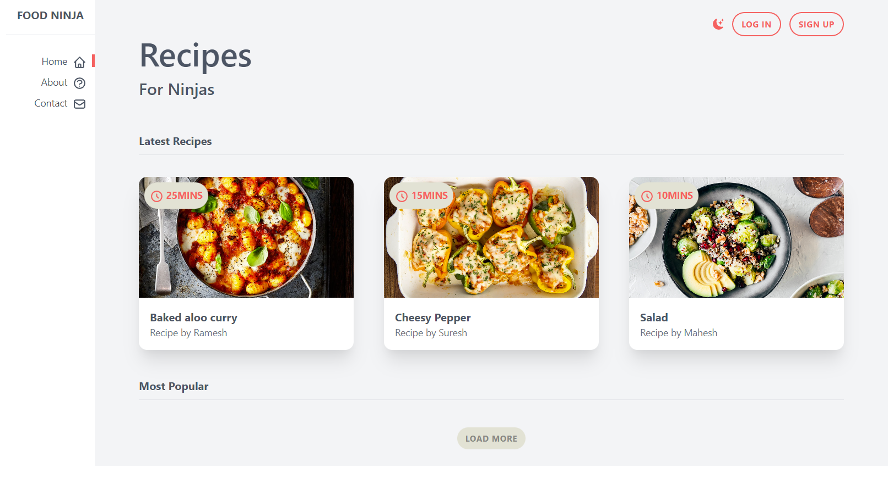
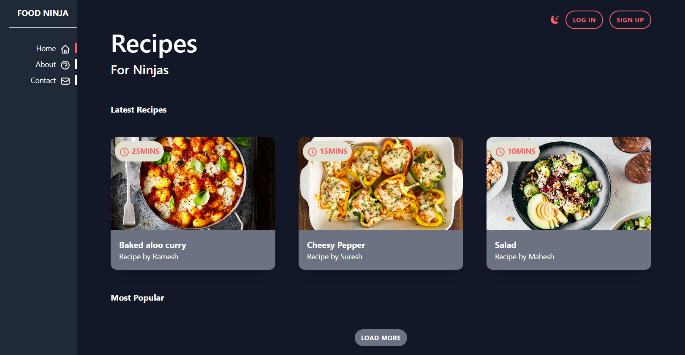

# Dark mode demo with Tailwind CSS

### Steps to kick-start

1. Open **index.html** from public folder directly or via live server.
2. Look for a moon icon on top right to switch to dark mode(Or Press the key **D/d** from keyboard) once you vist the webpage.

### Steps to create custom Tailwind classes or Components

##### To create custom clasess extend the theme property in **tailwind.config.js** file.

##### To create your own component:

1. Run >npm i
2. Create your component in **src/styles.css**
3. Run >npm run build-css
4. Open **public/index.html** in browser

